  

  
  
  

---

## 📊 GitHub Stats

<table>
  <tr>
    <td width="50%"></td>
    <td width="50%"></td>
  </tr>
</table>

## 📕 Latest Blog Posts

<!-- BLOG-POST-LIST:START -->
- [Linux 桌面环境全面指南：主流 GUI 桌面环境对比与安装](https://www.zeroxin.xin/2026/06/27/Linux-Desktop-Environments-Guide/)
- [IPtools 网络工具箱：Android 开源网络诊断工具，集成 Ping/端口扫描/路由追踪等 13 项功能](https://www.zeroxin.xin/2026/06/18/IPtools-%E7%BD%91%E7%BB%9C%E5%B7%A5%E5%85%B7%E7%AE%B1/)
- [Arkain ：注册与首购最高可得 9,900 Credits](https://www.zeroxin.xin/2026/04/14/arkain-referral-rewards-introduction/)
- [PageAgent：嵌入网页的 GUI 智能体，用自然语言控制 Web 界面](https://www.zeroxin.xin/2026/03/14/page-agent-introduction/)
- [Neko Master：现代化的网络流量可视化分析面板](https://www.zeroxin.xin/2026/02/17/Neko-Master-%E7%BD%91%E7%BB%9C%E6%B5%81%E9%87%8F%E5%8F%AF%E8%A7%86%E5%8C%96%E5%88%86%E6%9E%90%E9%9D%A2%E6%9D%BF/)
<!-- BLOG-POST-LIST:END -->

## 📈 Activity Graph

## 🐍 Contribution Snake

<picture>
  <source media="(prefers-color-scheme: dark)" srcset="https://raw.githubusercontent.com/xin-521/xin-521/output/github-contribution-grid-snake-dark.svg">
  <source media="(prefers-color-scheme: light)" srcset="https://raw.githubusercontent.com/xin-521/xin-521/output/github-contribution-grid-snake.svg">
  
</picture>

## 📈 Metrics

---

## 🛠️ Tech Stack

  
  
  
  
  
  
  
  
  
  
  
  

